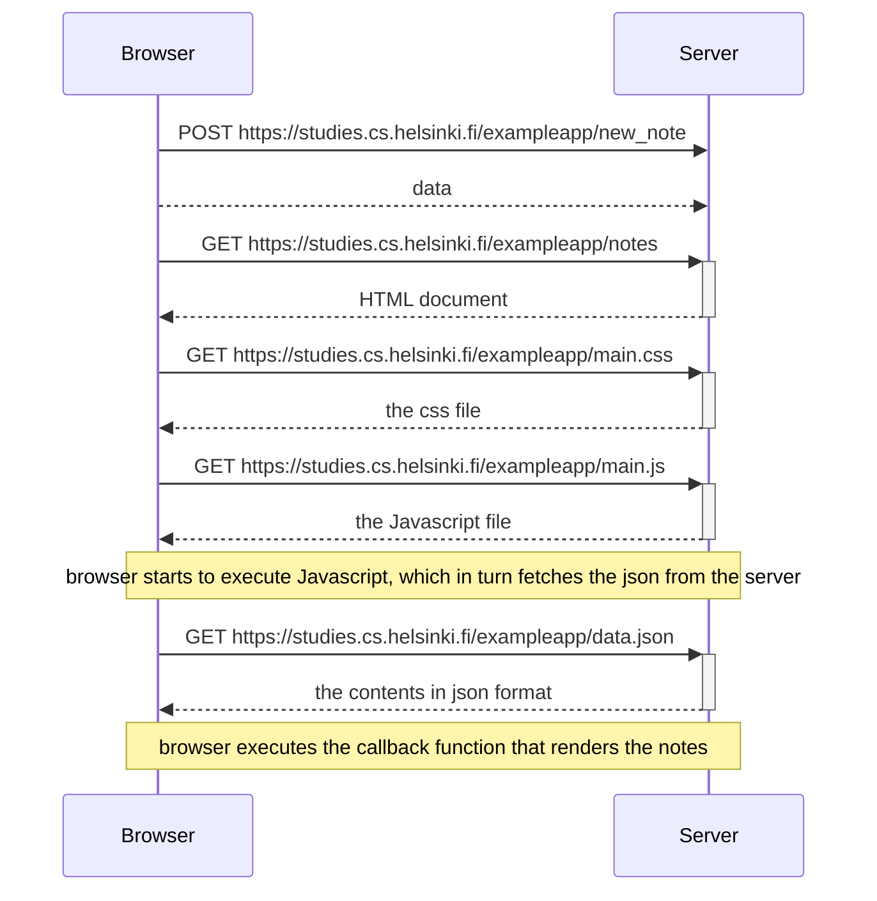

```mermaid
sequenceDiagram
    participant Browser
    participant Server
    Browser->>Server: POST https://studies.cs.helsinki.fi/exampleapp/new_note
    Browser-->>Server: data
    Browser->>+Server: GET https://studies.cs.helsinki.fi/exampleapp/notes
    Server-->>-Browser: HTML document
    Browser->>+Server: GET https://studies.cs.helsinki.fi/exampleapp/main.css
    Server-->>-Browser: the css file
    Browser->>+Server: GET https://studies.cs.helsinki.fi/exampleapp/main.js
    Server-->>-Browser: the Javascript file
    Note over Server,Browser: browser starts to execute Javascript, which in turn fetches the json from the server
    Browser->>+Server: GET https://studies.cs.helsinki.fi/exampleapp/data.json
    Server-->>-Browser: the contents in json format
    Note over Server,Browser: browser executes the callback function that renders the notes

```
    
